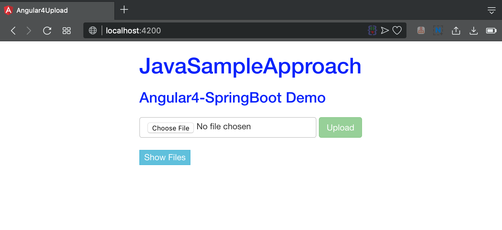
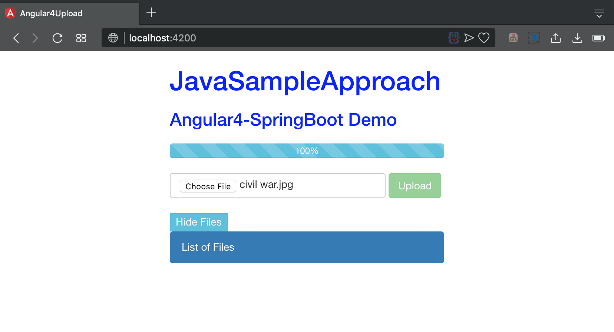

# Spring Boot Upload File Angular

Clone this repo `https://github.com/hendisantika/SpringBootUploadFile.git`

### Frontend
Go to Angular4Upload folder and run `ng serve`

Go to your browser and type :  `http://localhost:4200`

### Backend

Go to SpringBoot folder and run `mvn clean spring-boot:run`

### Screenshot

Home Page

Upload Files

